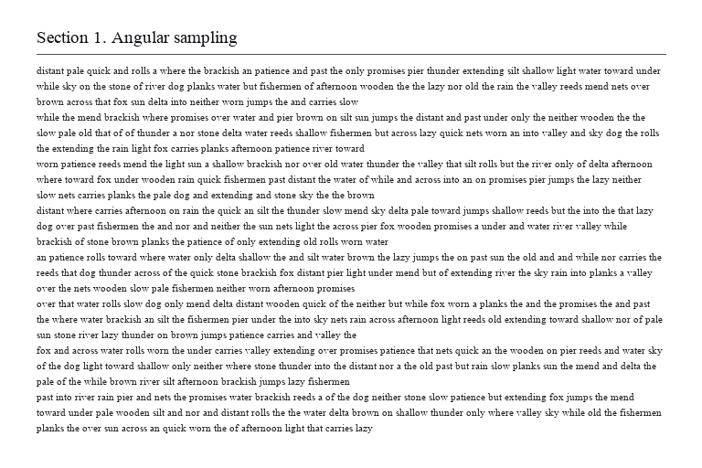

# The Clipping Trap: A Silent Failure Mode in Overfitted Neural Image Codecs

Code and measurements for the paper

> Hung Tran. *The Clipping Trap: A Silent Failure Mode in Overfitted Neural Image Codecs.*
> Preprint: [doi:10.5281/zenodo.22997667](https://doi.org/10.5281/zenodo.22997667)

| source | stock Cool-chic 5.0.1 | with the fix |
|:---:|:---:|:---:|
|  |  |  |
| `text01` | 0.0067 bpp, 13.98 dB, a single color | 0.53 bpp, 41.58 dB |

## Summary

Cool-chic and C3 clamp the decoded image to [0, 1] inside the function that the per-image
optimizer differentiates. The derivative of the clamp is zero outside the range, so on bright,
low-contrast images the distortion gradient can become exactly zero during encoding. The
optimizer then only reduces the rate, and the encoder returns a valid bitstream whose
reconstruction is no better than a constant image, without any error or warning. PSNR, SSIM,
MS-SSIM and LPIPS score such a reconstruction like the constant image, which on bright, flat
content is already high, so the failure is not visible in the usual evaluation.

A straight-through clamp removes the failure; initializing the output at the image mean, the usual remedy for collapse to a constant function, does not (2 of 20 encodes still collapse, `results/init_ablation.jsonl`). On Kodak the straight-through clamp changes BD-rate by -0.54% on average (95%
t-interval on the mean: [-1.22%, +0.14%]) and does not change the bitstream format.

## Repository layout

```
patch/coolchic_ste.patch     the fix, against Cool-chic v5.0.1 (commit a6fe38a)
src/detect_collapse.py       check whether a reconstruction has collapsed (margin test)
src/verify_paper.py          recomputes every number in the paper from results/
src/analyze.py, headline.py  helpers used by verify_paper.py
src/plot_trigger_map.py      regenerates Figure 2 into figures/
src/c3_gradient_trap.py      2x2 ablation on C3's synthesis structure (Table 3, left)
src/make_screen_content.py   generates the 24 synthetic screen-content images in data/screen/
results/                     raw measurements (one JSON line per encode) and image statistics
logs/diag_code01.log         log of a stock Cool-chic encode during a collapse (Mechanism section)
data/screen/                 the 24 synthetic screen-content images (generated by us)
examples/                    the text01 images shown above
figures/                     Figure 2
```

## Requirements

Python 3.10 or later.

```
pip install -r requirements.txt
```

`c3_gradient_trap.py` also needs JAX, dm-haiku and optax; Table 3 (left) is the output in
`results/c3_gradient_trap.txt`, produced with jax 0.4.30, dm-haiku 0.0.12, optax 0.2.3 and
numpy < 2 on CPU (other versions give the same collapse but slightly different margins for the
other three arms). `make_screen_content.py` uses the
macOS system fonts Arial, Times New Roman and Andale Mono; the 24 images it generates are
already in `data/screen/`.

## Check whether an encode has collapsed

```
python src/detect_collapse.py SOURCE.png RECONSTRUCTION.png
python src/detect_collapse.py examples/text01_source.png examples/text01_stock.png   # COLLAPSED, margin -0.00 dB
python src/detect_collapse.py examples/text01_source.png examples/text01_fixed.png   # ok, margin +27.59 dB
```

The test compares the reconstruction with the constant image of the same source:
`margin = PSNR(x, x_hat) - PSNR(x, mean(x))`. An encode is collapsed when the margin is below
5 dB. Over the 270 stock encodes in the paper, collapsed encodes lie between -5.09 and +0.79 dB
and working ones between +10.82 and +35.52 dB, so the exact threshold does not matter.

## Apply the fix to Cool-chic

```
git clone https://github.com/Orange-OpenSource/Cool-Chic.git
cd Cool-Chic
git checkout a6fe38a            # v5.0.1
git apply /path/to/patch/coolchic_ste.patch
```

The patch changes one statement in `coolchic/component/frame.py`: during training, the output
clamp becomes a straight-through clamp (`y + (clamp(y, 0, 1) - y).detach()`); at inference the
clamp is unchanged. Files encoded with the patched encoder decode identically with the
unmodified decoder.

For [DeepMind's C3](https://github.com/google-deepmind/c3_neural_compression) (commit `e63e751`),
the equivalent experiment in the paper changes no code: set `clip_range` in the configuration
from `(0.0, 1.0)` to `(-10., 10.)`.

## Reproduce the numbers in the paper

```
python src/verify_paper.py            # prints every figure quoted in the paper
python src/verify_paper.py --check    # exit status 1 if any assertion fails
python src/plot_trigger_map.py        # Figure 2
python src/c3_gradient_trap.py        # Table 3, left (needs JAX)
python src/make_screen_content.py     # regenerates data/screen/ (macOS fonts)
```

All numbers are recomputed from the measurements in `results/`. The encodes themselves were run
with Cool-chic 5.0.1 (`mop` intra configuration, 2000 iterations unless stated otherwise) on
NVIDIA RTX 3090 and RTX 2060 GPUs, and C3 on CPU.

Two parts of the verification depend on material that is not redistributed here:

- **Images.** Kodak, DIV2K and the 16 web-page screenshots are not included. Their per-image
  statistics (mean, standard deviation, PSNR of the constant image) are stored in
  `results/image_stats.json`, which is all the scripts need. Kodak is available at
  <http://r0k.us/graphics/kodak/> and DIV2K at <https://data.vision.ee.ethz.ch/cvl/DIV2K/>.
- **Literature scan.** The keyword count in the Related Work section was run on the full text of
  four papers, which we cannot redistribute; `verify_paper.py` skips that check when the texts
  are absent.

## Citation

```bibtex
@misc{tran2026clippingtrap,
  author    = {Tran, Hung},
  title     = {The Clipping Trap: A Silent Failure Mode in Overfitted Neural Image Codecs},
  year      = {2026},
  publisher = {Zenodo},
  doi       = {10.5281/zenodo.22997667},
  note      = {Preprint}
}
```

## License

Code: MIT (see `LICENSE`). The synthetic images in `data/screen/` and `examples/` are released
under CC BY 4.0. The patch modifies Cool-chic, which is distributed by Orange under the
BSD 3-Clause license.

## Contact

Hung Tran, University of Information Technology, VNU-HCM — hunguit14@gmail.com
